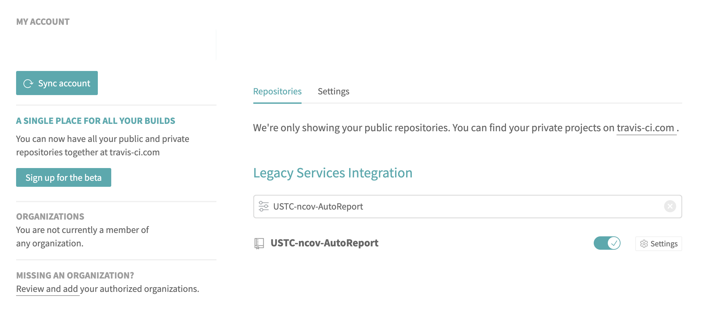
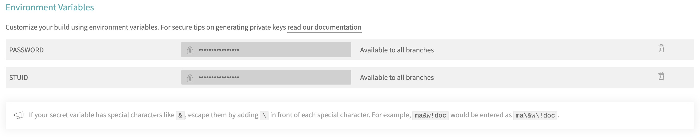
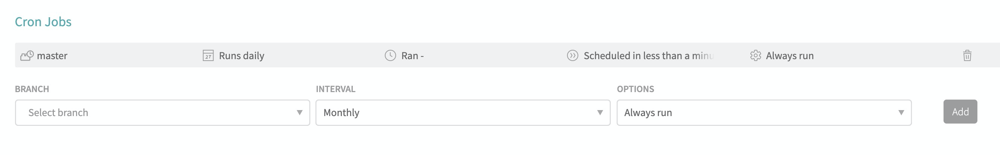

# 中科大健康打卡平台自动打卡脚本

## 说明

本代码仓库fork自[ForeverFancy/USTC-ncov-AutoReport](https://github.com/ForeverFancy/USTC-ncov-AutoReport)，在此基础上引入了持续集成功能实现全自动打卡。

## 使用方法

1. 将本代码仓库fork到自己的github。

2. 根据自己的实际情况修改data.json的数据，参看下文。**这里给出的 `data.json` 仅供参考。**

3. 将修改好的代码push至master分支。

4. 使用自己的github登陆[travis-ci.org](https://travis-ci.org)，启用本代码仓库的持续集成（如果找不到本仓库，请稍等一会后点击左侧Sync account）。

   

5. 在settings页面添加两个环境变量，分别是`STUID`和`PASSWORD`，内容分别是自己的学号和统一身份认证的密码。**请注意不要启用后面的DISPLAY VALUE IN BUILD LOG，因为构建记录是任何人都可以访问的。**

   

6. 在settings页面添加Cron Jobs，设置为master分支，Daily，Always Run。（**travis-ci不保证脚本执行的具体时间，所以最好不要在深夜添加这个Cron Job以免错过当天打卡**）

   

7. 你可以随时访问travis-ci.org查看构建记录来确认打卡情况。

## data.json 数据获取方法

使用 F12 开发者工具抓包之后得到数据，按照 json 格式写入 `data.json` 中。

1. 登录进入 `http://weixine.ustc.edu.cn/2020/`，打开开发者工具（Chrome 可以使用 F12 快捷键），选中 Network 窗口：

2. 点击确认上报，点击抓到的 `daliy_report` 请求，在 `Headers` 下面找到 `Form Data` 这就是每次上报提交的信息参数。

3. 将找到的 Data 除 `_token` （每次都会改变，所以不需要复制，脚本中会每次获取新的 token 并添加到要提交的数据中）外都复制下来，存放在 `data.json` 中，并参考示例文件转换为对应的格式。

4. 尝试运行脚本。

