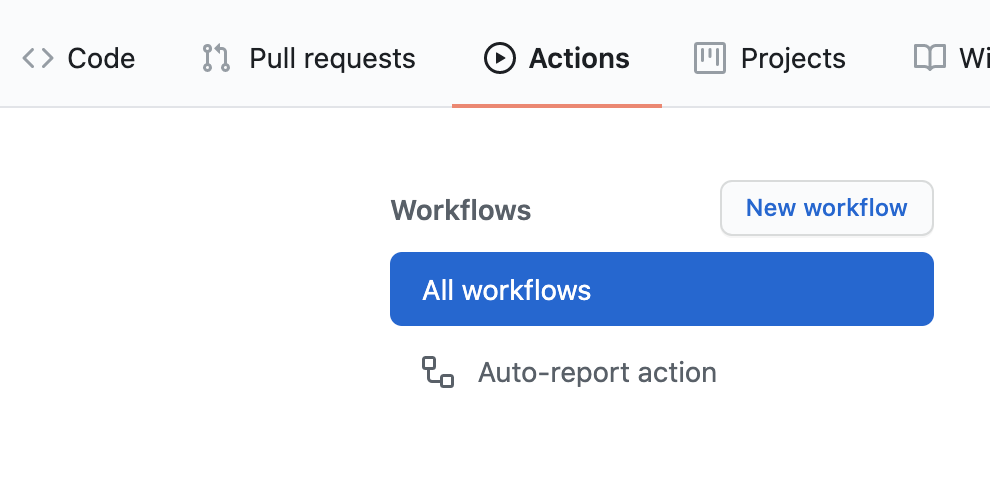
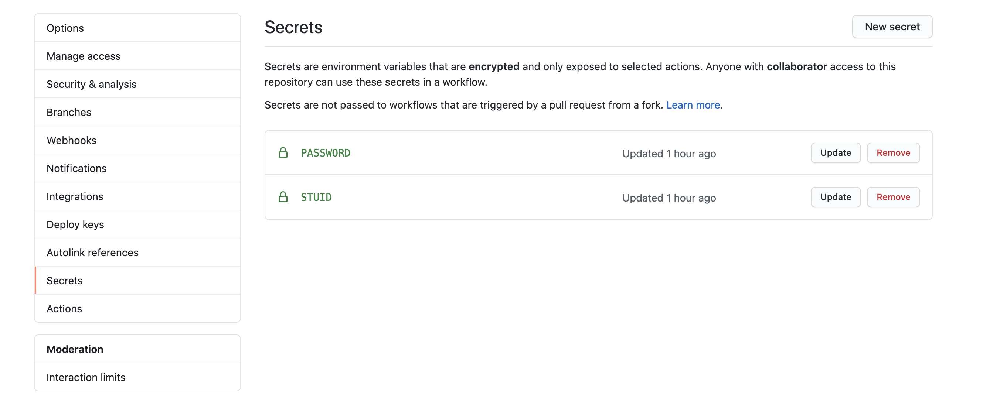
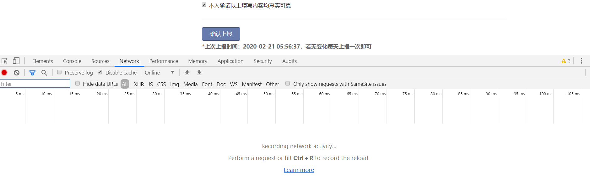
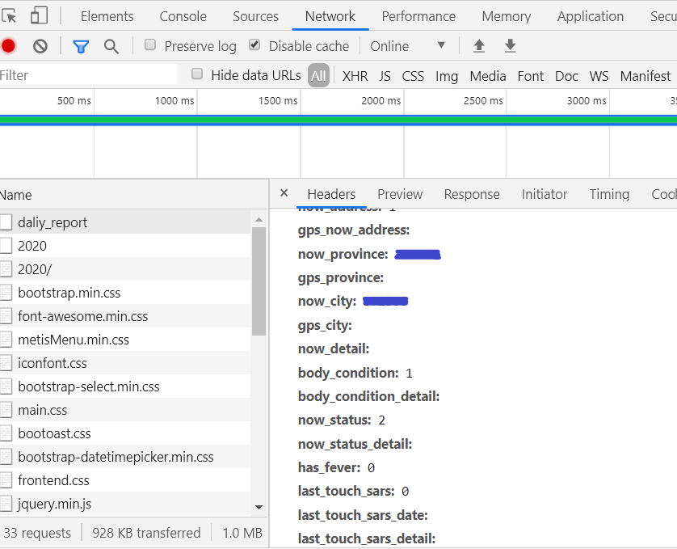

# 中科大健康打卡平台自动打卡脚本

## 说明

本代码仓库fork自[ForeverFancy/USTC-ncov-AutoReport](https://github.com/ForeverFancy/USTC-ncov-AutoReport)，在此基础上引入了持续集成功能实现全自动打卡。

## 更新记录

- 20200826：为配合学校最新规定，切换至Github Action实现一天三次打卡

## 使用方法

1. 将本代码仓库fork到自己的github。

2. 根据自己的实际情况修改data.json的数据，参看下文。**这里给出的 `data.json` 仅供参考。**

3. 将修改好的代码push至master分支。

4. 点击Actions选项卡，确认存在Auto-report action。

   

5. 点击Settings选项卡，点击左侧Secrets，点击New secret，创建名为`STUID`，值为自己学号的secret。用同样方法，创建名为`PASSWORD`，值为自己统一身份认证密码的secret。这两个值不会被公开。

   

6. 默认的打卡时间是每天的早上7:30、中午12:30和晚上19:30，可能会有数分钟的浮动。如需选择其它时间，可以修改`.github/workflows/report.yml`中的`cron`，详细说明参见[安排的事件](https://docs.github.com/cn/actions/reference/events-that-trigger-workflows#scheduled-events)，请注意这里使用的是**国际标准时间UTC**，北京时间的数值比它大8个小时。

## data.json 数据获取方法

使用 F12 开发者工具抓包之后得到数据，按照 json 格式写入 `data.json` 中。

1. 登录进入 `http://weixine.ustc.edu.cn/2020/`，打开开发者工具（Chrome 可以使用 F12 快捷键），选中 Network 窗口：

2. 点击确认上报，点击抓到的 `daliy_report` 请求，在 `Headers` 下面找到 `Form Data` 这就是每次上报提交的信息参数。

3. 将找到的 Data 除 `_token` （每次都会改变，所以不需要复制，脚本中会每次获取新的 token 并添加到要提交的数据中）外都复制下来，存放在 `data.json` 中，并参考示例文件转换为对应的格式。

4. 通过push操作触发构建任务，检查上报数据是否正确。

